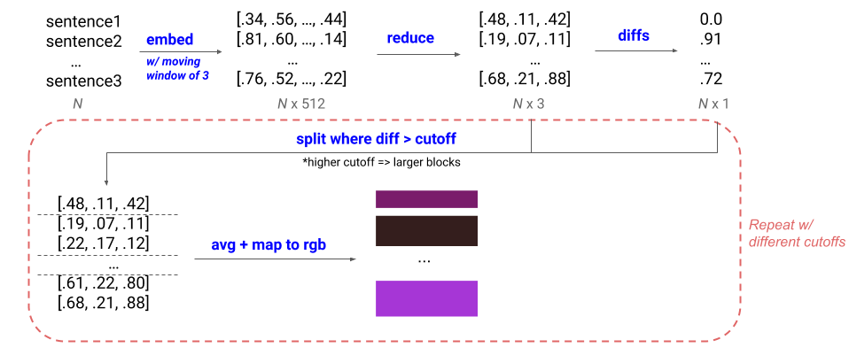
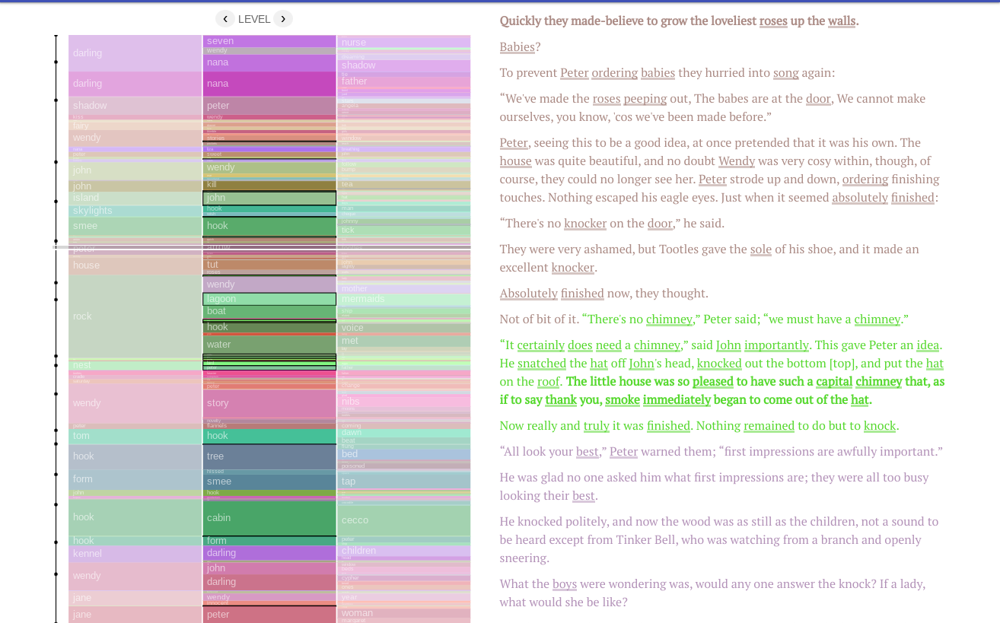
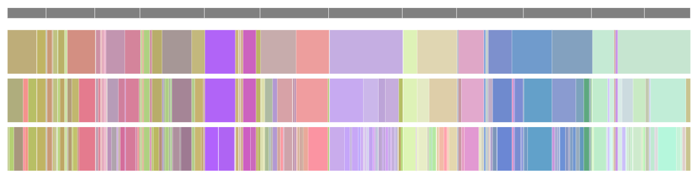

# Visualizing Multilevel Structure in Books with Sentence Embeddings

## tl;dr
- To generate data: run GenerateBookData.ipynb in the colab folder. Move the saved files to the data folder. 
- To run: `npm start` (this will automatically watch for changes in the source)
- To see the most recent viz: navigate to section-text.html

## Project Description
A good way to visualize a book can be useful for summarization, comparing different books and authors, as a starting point for closer reading, or as a tool for thematic and/or structural analysis.  There are a number of existing proposals for different ways to visualize books, primarily based off of 1) frequency-based statistics (e.g., number of sentences per paragraph/chapter), 2) higher-order statistics (e.g., scores that measure vocabulary richness) or 3) predefined themes or categories (e.g., sentiment).  At the same time, there have been rapid advances in learning-based NLP techniques. Here, we explore whether using learned embeddings can lend new insights into the book visualization problem.  

## Methods
This repo contains code for several viz prototypes.  They are based off of the same data, with one small distinction.  The viz in `rect-grid.html` displays all sentences, each with their own color determined by the embedding of that sentence.  The others display *sections* of sentences. 

### Sentence-level visualizations
For the sentence-level viz in `rect-grid.html`, we display each sentence as a rectangle, in vertical columns representing chapters. The colors are computed by first embedding each sentence (+ optionally some window of context around the sentence), mapping the embeddings to a 3D space with TSNE, UMAP or PCA, and using the 3 dimensions to define a color in RGB space. 

In the sentence-level visualization, you can toggle several options in the menu dropdowns: 
- Dim. reduction: determines what algorithm is used to do dimensionality reduction.
- Moving avg. window: the number of sentences on either side of the input sentence that are also included as context when embedding. 
- Order: whether the sentences are displayed in chronological order, or ordered by color (if color, order is determined by the hue in HSL color space).
- Components: whether to display all three dimensions as an RGB color, or just intensity in a particular dimension.

### Section-level visualizations
The visualizations in `entire-book-clusters.html`, `zoom.html`, `chapter-scroll.html`, and `section-text.html` are all based off of section-level data, where sentences are grouped into sections at different levels of granularity.  To compute section-level data, we first embed + reduce dimensionality of sentences in the same way as in the sentence-level information.  Then, we take the diff between consecutive 3D vectors and create splits where the diff is above a cutoff.  We change the cutoff to get different-sized blocks: a bigger cutoff will lead to fewer, larger blocks, and vice versa. 

In the visualizations, the exact cutoffs are determined for each book such that they result in a specific number of sections.  In addition, we use k-means clustering to assign a cluster label to each section. The number of clusters is min(8, num_sentences/500). 

#### Different section-level visualizations 
There are a few different html files that will load different visualizations based off of the section-level data. 
- `section-text.html`: This is the main visualization. It consists of 3 vertical bars on the left corresponding to the entire book split up into sections with different cutoffs. Annotations in each section are determined by running a TF-IDF vectorizer on all the sections in a given level, where each section corresponds to a document. The word with the highest coefficient is displayed. If the top word appears in a parent block to the left, the word with the next highest coefficient is displayed. On the righthand side, the full text appears, colored by the section colors of the selected level. The words corresponding to the top 20 TF-IDF words are underlined, and the sentences that are closest to the cluster centroid are bolded.  When you click on a section, a modal pops up with a list of the top TF-IDF words and the important sentences from other sections with the same cluster label. 

- `entire-book-clusters.html`: Essentially the same bars as the main visualization, but viewed horizontally. The text in a given section appears on hover.

- `zoom.html`: A zoomable prototype -- basically the same as `entire-book-clusters.html`, but you only see the highest level and get more granular as you zoom in.
- `chapter-scroll.html`: Similar to the main visualization, but you only see bars for one chapter at a time. When you scroll to the next chapter in the text, the visualization updates to show data for that chapter.

## Running the Visualization
### Generating Data
GenerateBookData.ipynb in the colab folder 1) downloads raw book text for 11 books from [Project Gutenberg](http://www.gutenberg.org/), 2) saves a single JSON file with sentences, chapter breaks, and other metadata for all books (`book_text_data.json`), 3) saves a zip file containing a JSON for each book, where entries correspond to sections at different levels of granularity (`section_text_data.zip`), and 4) saves zip files containing reduced-dimensionality embeddings for each book via TSNE, UMAP, and PCA in byte format (`tsne_bytes.zip`, `umap_bytes.zip`, and `pca_bytes.zip`).  

You need 1) for all visualizations, 2) for any of the section-level visualizations, and 3) for the sentence-level visualizations.

After running all cells, you should see the downloaded files. Move book_text_data.json to the `data` folder of the repo. Unzip the zip files and for each, move the directory within the `content` directory to the `data` folder of the repo.  

### Running the App 
`npm prestart` will just run the TypeScript compiler and bundle with rollup.  `npm start` will compile + serve the app and watch for changes in the source.  The console will output the URL & port, and from there, navigate to the html page of the visualization of interest (`section-text.html` for the main viz).